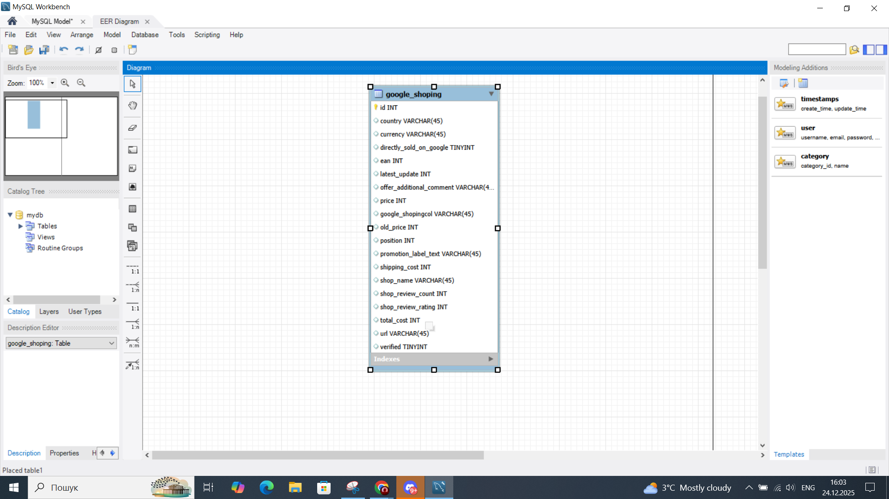
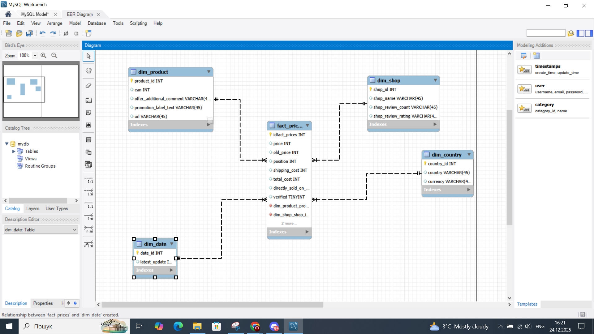
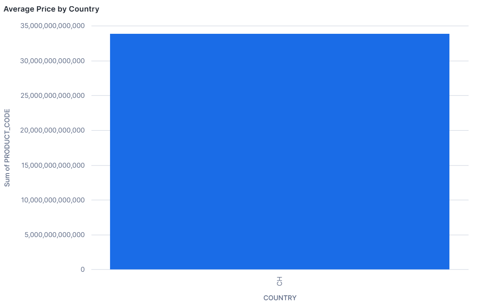
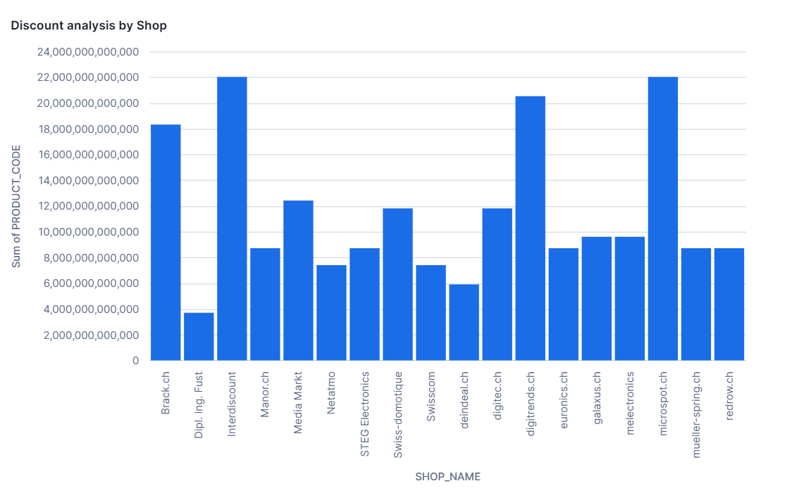
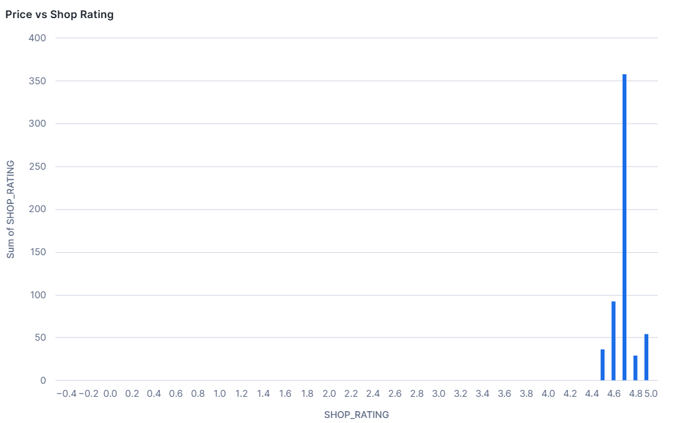
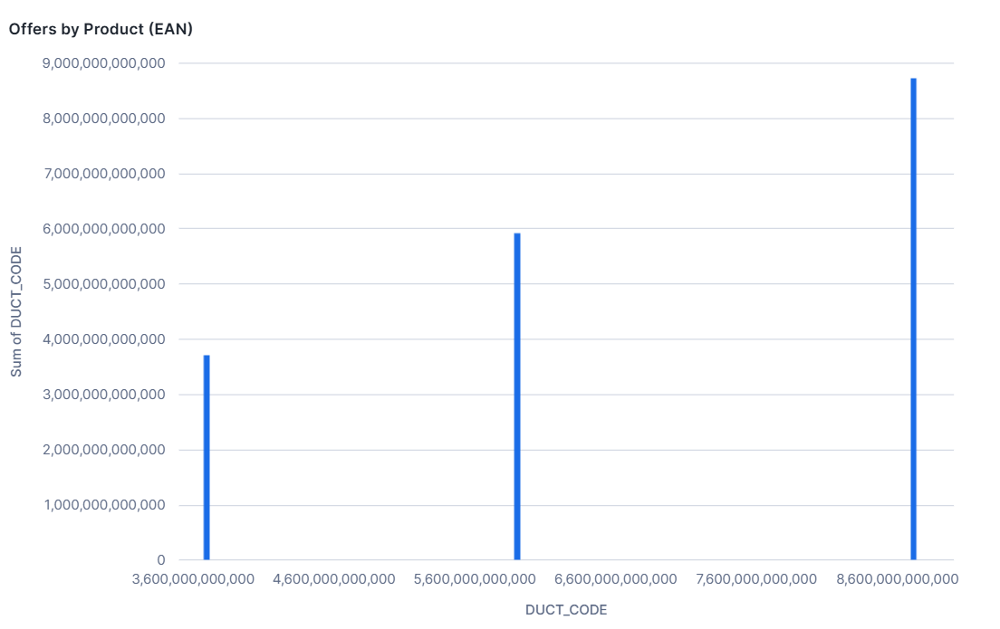

# Google Shopping ELT projekt

Tento projekt demonštruje kompletný ELT proces implementovaný v Snowflake s využitím dát zo Snowflake Marketplace.  
Cieľom projektu je vytvoriť dimenzionálny model typu **Star Schema** a pripraviť analytické vizualizácie, ktoré odpovedajú na dôležité otázky týkajúce sa cien a konkurencie v online retaili.

## Zdroj dát

- **Snowflake Marketplace**
- Dataset: **Google Shopping Products Prices Dataset**
- Dáta obsahujú informácie o produktoch, cenách, obchodoch, krajinách, pozíciách v Google Shopping, nákladoch na dopravu a overení predajcov.

# Dátová architektúra

## ERD diagram



# Dimenzionálny model

- `DIM_PRODUCT` – informácie o produktoch (EAN, promo text, URL)
- `DIM_SHOP` – informácie o obchodoch a hodnoteniach
- `DIM_COUNTRY` – krajiny a meny
- `DIM_DATE` – dátum poslednej aktualizácie

## Star schema



# ELT proces v Snowflake

Projekt je postavený na princípe ELT:

### Extract  
Dáta sú extrahované zo Snowflake Marketplace (zdieľaná databáza iba na čítanie).

```sql
SELECT *
FROM GOOGLE_SHOPPING_PRODUCTS_PRICES_DATASET.PUBLIC.GOOGLE_SHOPPING;
``` 

### Load

Extrahované dáta sú načítané do vlastnej databázy ako RAW vrstva:

```sql
CREATE OR REPLACE TABLE RAW_GOOGLE_SHOPPING AS
SELECT *
FROM GOOGLE_SHOPPING_PRODUCTS_PRICES_DATASET.PUBLIC.GOOGLE_SHOPPING;
```

### Transform 

Transformácie prebiehajú priamo v Snowflake, kde sú dáta rozdelené do dimenzionálneho modelu (Star Schema).

### DIM_PRODUCT
- **Účel:** Obsahuje informácie o produktoch.
- **Stĺpce:**  
  - `PRODUCT_ID` – unikátny identifikátor produktu (surrogate key)  
  - `EAN` – jedinečný kód produktu  
  - `OFFER_ADDITIONAL_COMMENT` – doplnkové informácie k produktu  
  - `PROMOTION_LABEL_TEXT` – text promo akcie  
  - `URL` – odkaz na produkt  

- **Dôvod návrhu:**  
  - Surrogate key umožňuje oddeliť technickú identifikáciu od EAN  
  - Uľahčuje rýchle spojenia s faktovou tabuľkou  
  - Podporuje analýzu cien a promo akcií nezávisle od ostatných atribútov  

```sql
CREATE OR REPLACE TABLE DIM_PRODUCT AS
SELECT
    ROW_NUMBER() OVER (ORDER BY EAN) AS PRODUCT_ID,
    EAN,
    OFFER_ADDITIONAL_COMMENT,
    PROMOTION_LABEL_TEXT,
    URL
FROM RAW_GOOGLE_SHOPPING
GROUP BY
    EAN,
    OFFER_ADDITIONAL_COMMENT,
    PROMOTION_LABEL_TEXT,
    URL;
```

### DIM_SHOP
- **Účel:** Obsahuje informácie o obchodoch.
- **Stĺpce:**  
  - `SHOP_ID` – unikátny identifikátor obchodu  
  - `SHOP_NAME` – názov obchodu  
  - `SHOP_REVIEW_COUNT` – počet recenzií  
  - `SHOP_REVIEW_RATING` – priemerné hodnotenie  

- **Dôvod návrhu:**  
  - Surrogate key umožňuje rýchle a jednoznačné spojenie  
  - Umožňuje analýzu podľa predajcu  
  - Podporuje sledovanie trendov v hodnotení obchodu a ich vplyv na ceny  

```sql
CREATE OR REPLACE TABLE DIM_SHOP AS
SELECT
    ROW_NUMBER() OVER (ORDER BY SHOP_NAME) AS SHOP_ID,
    SHOP_NAME,
    SHOP_REVIEW_COUNT,
    SHOP_REVIEW_RATING
FROM RAW_GOOGLE_SHOPPING
GROUP BY
    SHOP_NAME,
    SHOP_REVIEW_COUNT,
    SHOP_REVIEW_RATING;
```

###  DIM_COUNTRY
- **Účel:** Obsahuje informácie o krajinách predaja.
- **Stĺpce:**  
  - `COUNTRY_ID` – unikátny identifikátor krajiny  
  - `COUNTRY` – názov krajiny  
  - `CURRENCY` – mena krajiny  

- **Dôvod návrhu:**  
  - Umožňuje analýzu cien a predajov podľa regiónov  
  - Surrogate key zjednodušuje spojenia s faktovou tabuľkou  
  - Podporuje porovnanie cien medzi krajinami

 ```sql
CREATE OR REPLACE TABLE DIM_COUNTRY AS
SELECT
    ROW_NUMBER() OVER (ORDER BY COUNTRY) AS COUNTRY_ID,
    COUNTRY,
    CURRENCY
FROM RAW_GOOGLE_SHOPPING
GROUP BY
    COUNTRY,
    CURRENCY;
 ```

### DIM_DATE
- **Účel:** Obsahuje informácie o dátume poslednej aktualizácie.
- **Stĺpce:**  
  - `DATE_ID` – unikátny identifikátor dátumu  
  - `LATEST_UPDATE` – timestamp poslednej aktualizácie  
  - `DATE_VALUE` – hodnota dátumu (bez času)  

- **Dôvod návrhu:**  
  - Surrogate key umožňuje jednoznačné spojenie  
  - Oddelenie dátumu uľahčuje časové analýzy  
  - Podporuje reporting a vizualizácie  

```sql
CREATE OR REPLACE TABLE DIM_DATE AS
SELECT
    ROW_NUMBER() OVER (ORDER BY LATEST_UPDATE) AS DATE_ID,
    LATEST_UPDATE,
    TO_DATE(TO_TIMESTAMP(LATEST_UPDATE)) AS DATE_VALUE
FROM RAW_GOOGLE_SHOPPING
GROUP BY LATEST_UPDATE;
```
### Faktová tabuľka
- `FACT_PRICES`  
  Obsahuje metriky na úrovni ponuky:
  - price
  - old_price
  - shipping_cost
  - total_cost
  - position
  - verified
  - directly_sold_on_google

```sql
CREATE OR REPLACE TABLE FACT_PRICES AS
SELECT
    p.PRODUCT_ID,
    s.SHOP_ID,
    c.COUNTRY_ID,
    d.DATE_ID,

    t.PRICE,
    t.OLD_PRICE,
    t.SHIPPING_COST,
    t.TOTAL_COST,
    t.POSITION,

    CAST(t.DIRECTLY_SOLD_ON_GOOGLE AS NUMBER(1,0)) AS DIRECTLY_SOLD_ON_GOOGLE,
    CAST(t.VERIFIED AS NUMBER(1,0)) AS VERIFIED

FROM RAW_GOOGLE_SHOPPING t
JOIN DIM_PRODUCT p
    ON t.EAN = p.EAN
JOIN DIM_SHOP s
    ON t.SHOP_NAME = s.SHOP_NAME
JOIN DIM_COUNTRY c
    ON t.COUNTRY = c.COUNTRY
JOIN DIM_DATE d
    ON t.LATEST_UPDATE = d.LATEST_UPDATE;
```

## Vizualizácie

Na základe dimenzionálneho modelu bolo vytvorených 5 vizualizácií:

### Priemerná cena produktu podľa krajiny



```sql
SELECT
    c.COUNTRY,
    p.EAN AS product_code,
    ROUND(AVG(f.PRICE), 2) AS avg_price
FROM FACT_PRICES f
JOIN DIM_COUNTRY c ON f.COUNTRY_ID = c.COUNTRY_ID
JOIN DIM_PRODUCT p ON f.PRODUCT_ID = p.PRODUCT_ID
GROUP BY c.COUNTRY, p.EAN
ORDER BY c.COUNTRY, avg_price DESC
LIMIT 100;
```
### Priemerná zľava podľa obchodu a produktu



```sql
SELECT
    s.SHOP_NAME,
    p.EAN AS product_code,
    ROUND(AVG(
        CASE 
            WHEN f.OLD_PRICE IS NOT NULL AND f.OLD_PRICE > f.PRICE 
            THEN f.OLD_PRICE - f.PRICE
            ELSE 0
        END
    ), 2) AS avg_discount
FROM FACT_PRICES f
JOIN DIM_SHOP s ON f.SHOP_ID = s.SHOP_ID
JOIN DIM_PRODUCT p ON f.PRODUCT_ID = p.PRODUCT_ID
GROUP BY s.SHOP_NAME, p.EAN
ORDER BY avg_discount DESC
LIMIT 100;
```

## Cena produktu vs hodnotenie obchodu



```sql
SELECT
    s.SHOP_REVIEW_RATING AS shop_rating,
    p.EAN AS product_code,
    f.PRICE AS price
FROM FACT_PRICES f
JOIN DIM_SHOP s ON f.SHOP_ID = s.SHOP_ID
JOIN DIM_PRODUCT p ON f.PRODUCT_ID = p.PRODUCT_ID
WHERE s.SHOP_REVIEW_RATING IS NOT NULL
LIMIT 500;
```

## Distribúcia cien produktov


```sql
SELECT
    FLOOR(f.PRICE / 10) * 10 AS price_bucket,
    COUNT(*) AS offers_count
FROM FACT_PRICES f
WHERE f.PRICE IS NOT NULL
GROUP BY price_bucket
ORDER BY price_bucket;
```

## Počet ponúk podľa produktu



```sql
SELECT
    p.EAN AS product_code,
    COUNT(*) AS offers_count
FROM FACT_PRICES f
JOIN DIM_PRODUCT p
    ON f.PRODUCT_ID = p.PRODUCT_ID
GROUP BY p.EAN
ORDER BY offers_count DESC
LIMIT 20;
```

# Autor: Artem Makarin


